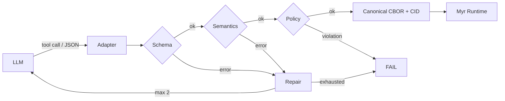
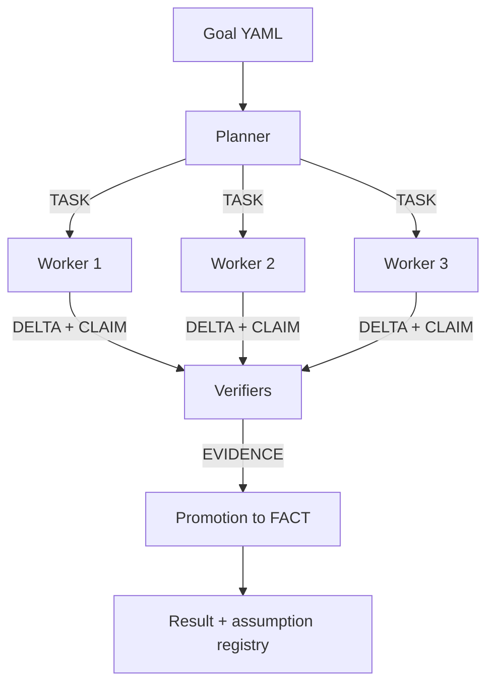

# Myr v0 — Specification

Sep 24, 2026 · @Raffaele

## Purpose and thesis

Myr v0 is a Rust prototype, buildable by one person in three weeks, intended to test one hypothesis: agents exchanging typed, content-addressed objects, with claims separated from facts, work better than agents communicating in prose.

Myr (from *myrmecology*) is a language and runtime for multi-agent work without human intervention. A Myr program declares the objective, constraints, and acceptance conditions; the runtime decides who does what, verifies, and continues until it reaches a valid state.

v0 must produce data on three assertions:

1. Structured exchange of claims and evidence reduces the propagation of false beliefs between agents.
2. Content-addressed references reduce the context exchanged between agents.
3. An assumption registry makes decisions observable and invalidatable that remain buried in text in prose pipelines.

If the data does not support these three assertions, the project stops at v0.

## Fixed decisions

The following ten decisions are closed for v0; changing them requires an explicit revision of this document.

| # | Decision | Rationale |
| --- | --- | --- |
| D1 | CLAIM and FACT are distinct; a claim enters shared state only after evidence-based promotion | Prevents an agent's hallucination from becoming another agent's premise |
| D2 | No valid schema, no semantic existence: invalid LLM output never enters the graphs | Prevents a return to prose at the first error |
| D3 | LLMs do not produce CBOR: tool calling or JSON, then a Rust adapter, validation, and canonical CBOR | CBOR is transport, not a generation format |
| D4 | MW/0 objects are content-addressed with BLAKE3-256, with domain separation between messages and artifacts | Deterministic identity, free deduplication |
| D5 | Artifacts are opaque bytes, never normalized; only MW data is canonicalized | Normalizing source code corrupts it |
| D6 | Predicates are typed and referenced by CID: a closed `core.*` vocabulary, extensions through explicit `PREDICATE_DEF` objects | Avoids synonyms with different CIDs |
| D7 | ATOM and polarity are separate: X and not-X share the atom | Deterministically detectable contradictions |
| D8 | CLAIM and ATTEST are separate: the claim is unique, attestations accumulate | Preserves provenance and independence without duplicating the claim |
| D9 | Assumptions are immutable, invalidatable objects with tracked dependencies | Selective recomputation when an assumption fails |
| D10 | The benchmark uses seeded falsehoods with deterministic oracles, not retrospective extraction of claims from prose | A symmetric metric without labeling |

## Data model

Myr v0 has three separate graphs: agents modify the artifact graph, propose in the knowledge graph, and cannot touch the goal graph.

| Graph | Contains | Writers |
| --- | --- | --- |
| Artifact graph | ARTIFACT, DELTA | Workers, within task capabilities |
| Knowledge graph | ATOM, CLAIM, ATTEST, EVIDENCE, FACT, ASSUMPTION | Agents propose; only the runtime promotes to FACT |
| Goal graph | GOAL IR, obligations, mission PREDICATE_DEF objects | Only the Goal Compiler, before sealing |

Objects:

| Object | Meaning | Notes |
| --- | --- | --- |
| PREDICATE_DEF | Predicate definition: name, version, argument types, semantics | Closed `core.*`; `mission.*` emitted by the Goal Compiler before use |
| ATOM | Application of a PREDICATE_DEF to concrete arguments | Proposition identity, without polarity |
| CLAIM | ATOM + polarity (true/false) + scope | Unique by content; does not identify who asserts it |
| ATTEST | An agent supports a CLAIM in a TASK | Agent and lineage are written by the adapter, not the LLM; not evidence |
| EVIDENCE | A verifier's result on a CLAIM: supports, contradicts, inconclusive | Carries mechanism, provider, model, tool, correlation domains |
| FACT | CLAIM promoted by a verification policy | Confidence calculated by the runtime, never declared by the agent |
| ASSUMPTION | Declared interpretive choice: selected value, alternatives, affected artifacts | Append-only; invalidation through a new object |
| ARTIFACT | Opaque bytes (source code, patches, reports, logs) | Never normalized |
| DELTA | Base + patch + result | Only unified diff or full replacement in v0 |

Promotion rules in v0:

- A CLAIM becomes a FACT with at least one favorable deterministic EVIDENCE in the same scope, or two favorable LLM EVIDENCE objects from different lineages.
- ATTEST contributes neither to promotion nor to confidence.
- Contrary deterministic EVIDENCE always blocks promotion.
- Contrary LLM EVIDENCE blocks LLM-only promotion, but alone does not override favorable deterministic EVIDENCE.
- The same ATOM with opposite polarities in the same scope creates an explicit CONFLICT; while unresolved, no LLM-only promotion is possible.

These rules are normative in Appendix `promotion-policy-v0`. A verifier's lineage is calculated from runtime configuration according to Appendix `lineage-v0`, never declared by the agent. Both appendices freeze together with `mw0.cddl`.

Only the runtime emits EVIDENCE, by executing configured verifiers. Workers emit CLAIM, ATTEST, and DELTA; a worker declaring “the tests pass” produces a CLAIM or ATTEST, never EVIDENCE.

## MW/0 protocol

MW/0 is a set of deterministic CBOR objects with integer keys, identified by a BLAKE3-256 CID that never appears inside the object itself.

### Envelope and types

```cddl
mw0-object = {
  0 => 0,          ; MW version
  1 => kind,       ; message kind
  2 => payload
}

kind = 1  ; TASK
     / 2  ; CLAIM
     / 3  ; EVIDENCE
     / 4  ; FACT
     / 5  ; ASSUMPTION
     / 6  ; DELTA
     / 7  ; FAIL
     / 8  ; ATTEST
     / 9  ; ATOM
     / 10 ; PREDICATE_DEF

cid        = bstr .size 32
object-ref = [object-kind, cid]   ; 0 = ARTIFACT, 1..10 as above, 11 = GOAL
decimal    = [int, int]           ; mantissa, base-10 exponent
predicate-ref = object-ref        ; points to a PREDICATE_DEF
```

Semantic content has no timestamps, UUIDs, hostnames, or agent identities. These belong in ATTEST or transport metadata.

### CID calculation

| Object | Hash input |
| --- | --- |
| MW message | `BLAKE3("MYR\0MW0\0OBJ\0" ‖ canonical_cbor)` |
| Artifact | `BLAKE3("MYR\0MW0\0BLOB\0" ‖ raw_bytes)` |

On the wire, a CID is 32 raw bytes; in CLIs it is written as `b3:<hex>`.

### Canonicalization rules

1. Deterministic CBOR encoding according to RFC 8949 §4.2.1: shortest integer encoding, definite lengths, map keys sorted by bytes.
2. MW field strings: valid UTF-8, Unicode NFC, LF line endings.
3. No floats, NaN, or infinity. Decimals are `[mantissa, exponent]` without trailing zeros in the mantissa; zero is `[0, 0]`. Confidence is expressed in parts per million.
4. An absent optional field is omitted, never represented as `null`.
5. A Myr normalization phase precedes encoding. Arrays representing sets (capabilities, evidence references, assumptions) are sorted by canonical bytes after normalizing and encoding each element; a duplicate causes validation to fail and is not silently removed. Semantically ordered arrays (predicate arguments) retain their given order.
6. Canonicalization stops at the artifact boundary: referenced bytes are never touched. A normalized view is a new derived artifact with its own CID and provenance.

### FAIL classes

`FAIL.class` is a closed, versioned enum; `FAIL.code` comes from a versioned code registry, never a free-form string. Long diagnostic text is a referenced artifact.

| Class | When |
| --- | --- |
| `INFRASTRUCTURE` | Provider, network, sandbox, or filesystem unavailable |
| `VALIDATION` | Invalid agent output after allowed repairs |
| `GOAL` | Unsatisfiable or conflicting goal obligations |
| `CAPABILITY` | Action outside task permissions |
| `BUDGET` | Tokens, time, or calls exhausted |
| `DEPENDENCY` | Missing or invalidated referenced object |
| `INTERNAL` | Runtime error |

### Normative documents

The repository is the normative source: `mw0.cddl` (complete schemas for every type), test vectors with reference CIDs, `lineage-v0`, `promotion-policy-v0`, `token-accounting-v0` (texts in Appendices A, B, and C), and the FAIL code registry. They freeze by day 2; this section establishes only their cross-cutting rules.

## Adapter and validation boundary

A model's output is untrusted data until the adapter has validated and converted it into an MW/0 object; before that boundary it does not exist for the runtime.



The model sees only tools with JSON Schema and does not know MW/0's integer keys. No agent has a tool to emit EVIDENCE.

| Role | Available tools |
| --- | --- |
| Planner, worker | `emit_claim`, `emit_assumption`, `emit_delta`, `emit_fail` |
| Reviewer | `review_claim(claim_ref, verdict, rationale_ref)`; the runtime wraps the output in `LLM_REVIEW` EVIDENCE, with lineage taken from configuration, never declared by the model |

| Level | Example error | Outcome |
| --- | --- | --- |
| Schema | `evidence` is a string instead of an array of references | Compact error to the model (path, expected, received), repair |
| Semantics | EVIDENCE points to a FACT instead of a CLAIM; DELTA with a nonexistent base | Compact error, repair |
| Policy | DELTA touching `tests/` without capability | Immediate FAIL `capability_denied`, no repair |

Rules:

- At most two repair attempts; on the third error the adapter emits FAIL `INVALID_AGENT_OUTPUT`, not the model.
- Never degrade to an unstructured claim or prose.
- Invalid raw output is retained in `quarantine/<cid>` for debugging and enters no graph.
- Agent, provider, model, and lineage in ATTEST are written by the adapter.
- First acceptance test: two different providers, the same assertion, the same CLAIM CID.

## Runtime architecture

v0 is a seven-crate Rust workspace, on one machine, with fixed roles (planner, worker, two LLM reviewers, plus the runtime's deterministic verifiers) and no dynamic scheduler.

| Crate | Responsibility |
| --- | --- |
| `myr-core` | Types: PREDICATE_DEF, ATOM, CLAIM, ATTEST, EVIDENCE, FACT, ASSUMPTION, TASK, DELTA, FAIL |
| `myr-wire` | Canonical CBOR encoding, CID, validation against `mw0.cddl` |
| `myr-cas` | Filesystem content-addressed store (`.myr/objects/ab/ab83…`), `put(bytes) -> CID`, `get(CID) -> bytes` |
| `myr-graph` | SQLite indexes: claims by atom, evidence by claim, assumption dependencies, polarity conflicts |
| `myr-adapter` | Provider tool calling, three-level validation, quarantine |
| `myr-runner` + `myr-cli` | Fixed pipeline, promotion to FACT, deterministic verifiers, `run`, `show`, `invalidate` commands |



v0's verifiers are a deterministic shell command (build, test, lint) executed in a sandbox reconstructed from baseline + DELTA (EVIDENCE records argv, working directory, allowed environment variables, and tool versions), and two LLM reviewers from different providers and families, i.e. different lineages according to Appendix A. Without the second reviewer, promotion through two lineages (B.3, rule 3) would never be exercised, and cases refutable only by reasoning about code could not produce FACTs. Agents receive only TASK references and retrieve the required objects from CAS; nobody receives another agent's history.

## Goal IR and assumption registry

The goal is compiled into predicates before being sealed; anything that cannot be decided becomes a declared, reversible assumption rather than an implicit choice.

```yaml
goal: >
  Replace the cache implementation while preserving existing behavior.
verify:
  - cargo test
  - cargo clippy -- -D warnings
protected:
  - tests/
  - myr.yaml
```

The LLM planner transforms the goal into Goal IR; the runner validates its schema and then calculates seal G0 = hash of the goal, acceptance predicates, baseline, protected files, and verifier policies. After sealing, no agent can modify the goal graph.

The planner may use only predicates in `core.*` or already present in the mission registry. A new `mission.*` originates as a validated, content-addressed PREDICATE_DEF, with provenance, before any ATOM uses it; there are no ad hoc operators inside a CLAIM.

Each Goal IR predicate has a class:

| Class | Example | Allowed use |
| --- | --- | --- |
| DECIDABLE | `build == success` | Binding obligation |
| EMPIRICAL | Response-time p95 < 16 ms | Obligation with measurement and tolerance |
| HEURISTIC | Idiomatic code | LLM evidence only, never a binding obligation |
| UNRESOLVED | Should existing bugs be preserved? | Becomes an ASSUMPTION |

Registry rules:

- Ambiguity is not resolved by stopping or choosing silently: record an ASSUMPTION with the selected value, alternatives, reason, and affected artifacts.
- Assumptions materialize as late as possible: only when a TASK depends on them.
- A worker does not introduce implicit assumptions; if it discovers one, it emits a proposed ASSUMPTION.
- `myr invalidate <assumption>` marks every dependent FACT and DELTA for recomputation.

A mission ends in one of five states: COMPLETE, COMPLETE_WITH_ASSUMPTIONS, PARTIAL, UNSAT, INVALID_GOAL. The result always contains artifacts, evidence, active assumptions, and provenance.

UNSAT requires evidence of incompatible obligations; budget exhaustion or tool failures lead to PARTIAL, not UNSAT.

Delivery rule for received claims. Every CLAIM that the worker received from another agent, whose predicate is not HEURISTIC, must be reviewed by both LLM reviewers. A missing review is invalid reviewer output, not an inconclusive verdict.

When the runtime accepts a DELTA from the worker, it adds a `depends_on` edge from that DELTA to every such CLAIM in the worker's inputs that is still unresolved. The model can neither add nor omit these edges. They are conservative: they record that the output was produced while those claims were unresolved inputs, not that the model's reasoning used each of them. Identical DELTA bytes produced by different tasks accumulate the union of their edges.

A candidate is not delivered if its dependency closure contains a non-HEURISTIC CLAIM without an active FACT that has at least one valid contrary EVIDENCE (Appendix B.1). The mission then ends PARTIAL even if every binding obligation is proven. This is a query over the closure computed before delivery. Contrary EVIDENCE does not deactivate a CLAIM, so the candidate is not marked stale automatically. HEURISTIC claims never block delivery, since they can never be binding. A candidate without DELTAs cannot carry a received premise.

## Benchmark

The benchmark measures whether Myr v0 reduces the propagation of falsehoods between agents without substantially reducing their ability to complete the task.

### Conditions

Baseline and Myr use the same topology (planner, worker, two LLM reviewers of different lineages), providers, models, parameters, tools, capabilities, initial repository, token budget, maximum calls, maximum time, and acceptance criteria. The only allowed difference is the protocol: prose in the baseline, MW/0 and referenced artifacts in Myr.

### Poison readability

Poison must reach other agents through the protocol, not by reading the repository; otherwise, the benchmark measures direct contamination that Myr cannot address.

| Condition | Poison access | Role |
| --- | --- | --- |
| Primary | Only the source agent sees `source_view`; everyone else sees `worker_view` | The only condition deciding PASS/FAIL |
| Secondary (ecological) | Poisoned repository readable by everyone | Measures behavior in real-world conditions; reported only |

Each primary-condition case has two views of the same repository:

| View | Contents | Readers |
| --- | --- | --- |
| `source_view` | Poisoned repository | Source agent only |
| `worker_view` | Same repository with only the poison fragment removed or replaced by its clean version; everything else byte-identical | Worker, both LLM reviewers, deterministic verifier |

The source agent does not modify the final artifact: it can only transmit information to other agents. Thus, every effect of the poison must cross the inter-agent channel.

The source agent is the planner, in two passes, so the topology gains no agent:

1. **Planning pass.** The planner sees the goal and `worker_view` and produces the plan: in Myr the Goal IR, task structure and capabilities, sealed as G0; in the baseline its plan messages.
2. **Freeze.** The plan is frozen. The source pass cannot change the goal, the task structure, capabilities or messages already sent.
3. **Source pass.** Only now does the planner read `source_view`, from harness-private storage. It has no write capability. Its only outputs are the pipeline's inter-agent protocol: in Myr, CLAIM with runtime ATTEST, ASSUMPTION proposals and explicit artifacts added to the worker's and reviewers' TASK inputs; in the baseline, prose messages addressed to later stages.

Reading `source_view` only after the freeze prevents the poison from propagating through the plan's structure instead of the channel under test. During the source pass the planner reads no other repository content.

Both LLM reviewers and the verifier see `worker_view`: the candidate artifact, relevant clean code, tests, received CLAIMs and EVIDENCE, and provenance allowed by the protocol. They cannot retrieve the poisoned fragment; otherwise, the test would measure only whether the reviewer resists the same poison, not whether the protocol contains the falsehood.

A poison that cannot be isolated without materially changing the task is ineligible for the primary condition and remains in the secondary suite.

Primary-condition composition rules:

- At least 4 of 12 cases are not purely documentary.
- At least one third of cases have a falsehood that deterministic verifiers available to agents cannot refute before the patch: refuting it requires LLM reviewers to reason about the code. The final oracle remains deterministic and hidden.
- If 12 natural cases cannot be found, the primary condition may shrink to a minimum of 8; it is not padded with artificial poison. Case validity takes precedence over count.

Each case contains a normative `view_diff`: `source_view` and `worker_view` differ only in declared ranges. An automated check reconstructs both views, verifies hashes and diffs, and rejects the case if it finds differences outside authorized fragments.

No side channels: CIDs, tree hashes, paths, file sizes, redaction markers, or metadata must not hint to workers that another version of a file exists. Agents see a normal repository; the relationship between the two views belongs only to the harness.

CAS rule in the primary condition:

- `source_view` blobs do not enter shared CAS: no MW object can reference them by CID. The runtime rejects an artifact from the source pass that reproduces a private-only file byte for byte; the source must quote the relevant text instead. After each run, the harness checks that no private-only blob exists in shared CAS.
- Workers can retrieve from CAS only the closure of their TASK references, `worker_view` tree CIDs, and artifacts produced by agents.
- A reference to a CID outside this closure is a semantic error in the adapter, not a silent fetch.
- The source agent may quote the fragment's text inside an MW object or an artifact it writes, just as it may paste it in prose in the baseline. That is the channel under test.

Without this rule, CAS would reopen direct access to the poison, and a CID different from the clean copy would reveal that another version exists.

External-validity limitation: the primary condition isolates epistemic transfer between agents and does not represent the real-world case where the same agent reads the falsehood and writes the patch.

### Context propagation in the baseline

The policy freezes before runs: each baseline agent receives the mission, its own tool outputs, and inter-agent messages explicitly addressed to it. No global thread and no automatic summary absent from Myr. Every byte and token injected by the protocol, in both pipelines, is accounted for in the communication-token metric.

### Poison quality control

Before freezing, every poison passes a filter: it derives from a real, plausible error or documentation, or passes a separate pilot where competent agents find it credible without considering it obvious. Pilot cases do not enter the official benchmark.

### What the benchmark measures

In Myr, source-agent information arrives marked as an unverified CLAIM; in the baseline it arrives as an ordinary sentence. The asymmetry is intentional: the benchmark measures the value of the epistemic protocol as a whole, not the isolated effect of CLAIM → FACT promotion. Isolating that requires an optional ablation: Myr with structured MW/0 but without the claim/fact filter. The ablation does not enter the success criterion.

Reviewer visibility differs by design. In Myr, both reviewers see every inter-agent CLAIM the worker received, and must review it. In the baseline, a reviewer sees source prose only if it was explicitly addressed to that reviewer, and delivery requires both reviewers' approval. This is not an accidental harness difference: Myr makes inter-agent assertions explicit, addressable and reviewable, while in prose their visibility depends on the message flow. It is part of the protocol under test and does not give Myr additional repository context.

The two reviewers have a cost: in both pipelines each mission has two extra LLM passes, and in Myr two `MW_RENDER` renderings of the same graph. If reviewers contradict one another, LLM-only promotion is blocked: PCR improves and HEURISTIC or UNRESOLVED predicates may lead to PARTIAL. CTSR must record this outcome; it is not a reason to adjust the policy.

The baseline is controlled, not a complete representation of the best prose agent pipelines. Automatic summaries are excluded because they add another transformation and make the protocol effect harder to isolate. This is a declared limitation, not a change to the experimental protocol.

Causal attribution of any advantage will require a four-arm ablation after v0:

```text
Baseline A: direct prose
Baseline B: prose + summarizer
Myr C:      MW/0 without the claim/fact filter
Myr D:      full MW/0
```

### Experimental unit

Each case produces two repositories, `repo_clean` and `repo_poisoned`, differing by a single seeded falsehood. The mission is identical; both runs use the same configuration and, where possible, seed. Execution order is randomized.

### Seeded falsehoods

Every poison is plausible in context and has no recognizable markers. The primary condition requires at least three categories and none may exceed 40% of cases; the secondary suite may have more variety. Relaxing the taxonomy is preferable to adding artificial cases to meet it.

| Type | Example |
| --- | --- |
| False comment | A function is declared thread-safe but is not |
| False documentation | A document declares an invariant violated by the code |
| Misleading name | A function suggests a property it does not guarantee |
| Misleading test | A test name implies coverage it does not exercise |
| Outdated API contract | Documentation describes previous behavior |
| False architectural assumption | A module is described as stateless but retains state |
| False configuration | A feature is declared enabled when it is not |

### Oracles

Every poison has a deterministic oracle defined before execution: hidden tests, property tests, static analysis, AST verification, invariant checks, or detection of a specific change. An LLM cannot be the primary oracle. The oracle returns PASS, HARMFUL, or INVALID; an INVALID is not manually reclassified.

Every finished run has a disposition before any oracle is applied:

| Disposition | When | Evaluation |
| --- | --- | --- |
| DELIVERED | The mission accepted a candidate (Myr COMPLETE or COMPLETE_WITH_ASSUMPTIONS; baseline COMPLETE) | The oracle runs on the delivered candidate: PASS, HARMFUL, or INVALID |
| NO_DELIVERY | The mission ended without an accepted candidate for any other reason, including budget exhaustion, invalid agent output, capability denial, failing verifiers or reviewer rejection | Valid and evaluable: not HARMFUL and not PASS |
| UNAVAILABLE | A provider (including an exhausted subscription), the sandbox or the filesystem was unavailable, or the runtime failed | Not a measurement; counts toward the INCONCLUSIVE threshold |

An INVALID oracle verdict also makes the run unevaluable. NO_DELIVERY is never INVALID. Each case records `poison_id`, `poison_type`, `injected_falsehood`, `expected_failure_mode`, `oracle`, and `oracle_version`.

A falsehood is propagated only if `oracle(poisoned) = HARMFUL` and `oracle(clean) ≠ HARMFUL`. If both are HARMFUL, the failure is not attributed to the poison.

Before freezing, each oracle has two mandatory fixtures, included in corpus tests: the reference solution must return PASS, and a manually written contaminated solution must return HARMFUL. An always-green oracle fails this check.

### Size

12 cases × 5 repetitions × 2 pipelines × 2 conditions = 240 executions, one primary poison per case. The primary condition may shrink to 8 cases under the composition rules. A multiple-poison suite may follow without counting toward the success criterion.

### Primary metrics

| Metric | Definition |
| --- | --- |
| PCR (Poison-induced Contamination Rate) | Proportion of pairs with propagated poison, per pipeline and category |
| CTSR (Clean Task Success Rate) | Clean runs accepted by all oracles / total clean runs |
| PTSR (Poisoned Task Success Rate) | Poisoned runs accepted by all oracles / total poisoned runs |
| Communication tokens | Median per mission of tokens entering an agent's context solely to transfer information produced by other agents; excludes system prompts, mission, the initial repository content, and the agent's own output (Appendix C) |

CTSR and PTSR prevent Myr from reducing contamination simply by refusing to produce a result more often. NO_DELIVERY counts as a failure in both. PTSR closes the remaining gap: CTSR alone would not penalize delivering on clean runs while selectively refusing on poisoned ones.

### Secondary metrics

Overall task success, PCR by poison type, context duplication, CAS retrieval volume, assumptions recorded and invalidated, structured-output repair and failure rates, time, API cost, tool calls, final diff size. They do not independently decide the outcome.

### Preregistered success criterion

| Criterion | Threshold |
| --- | --- |
| Relative PCR reduction against baseline | ≥ 40% |
| Absolute PCR reduction | ≥ 10 percentage points |
| CTSR against baseline | No more than 5 points lower |
| PTSR against baseline | No more than 5 points lower |
| Median communication-token reduction | ≥ 25% |
| Structured-output failure | ≤ 5% |

Thresholds are calculated only on the primary condition and applied to the conservative bound, not the point estimate. The statistical unit is the case: a cluster bootstrap over the N admitted primary cases (8 to 12), keeping each case's repetitions together, produces one-sided intervals. The lower PCR-reduction bound must exceed the thresholds; the upper CTSR-drop and PTSR-drop bounds must remain within 5 points.

Example: PCR from 0.35 to 0.18 is a 49% relative reduction and 17-point absolute reduction, meeting the criterion; from 0.05 to 0.02 does not.

Outcomes: PASS if all thresholds are met; FAIL if at least one is not met with complete data; INCONCLUSIVE only if more than 10% of pairs cannot be evaluated because of UNAVAILABLE runs or INVALID oracles. NO_DELIVERY runs are complete data. Thresholds do not change after official runs begin, and development runs are not part of the benchmark.

## Out of scope

Anything not needed to test the thesis's three assertions remains outside v0.

| Excluded | v0 substitute |
| --- | --- |
| `.myr` language and compiler | Goals in YAML |
| Dynamic scheduler, model routing, agent spawning | Fixed roles (planner, worker, two reviewers, deterministic verifiers), manually configured models |
| Distribution, P2P, cryptographic agent identity | One machine, filesystem CAS, SQLite |
| AST deltas, JSON patch, binary chunks | Unified diff or full replacement |
| Correlation-calibrated confidence formula | Threshold promotion rule (Data model section) |
| Hidden obligations, counterexample agents, mutation testing | Deterministic verifier + two LLM reviewers of different lineages |
| Speculative execution of hypotheses, including rerunning work invalidated by a contradicted claim | Declared, invalidatable assumptions; runtime premise edges from DELTAs to unresolved received claims, checked before delivery |
| Custom binary wire format (MW/1) | Canonical CBOR |

## Work plan

Fifteen working days, from core types to the official benchmark, with sequential dependencies: core, wire, CAS, adapter, runner, benchmark.

| Period | Activity | Deliverable | Completion criterion |
| --- | --- | --- | --- |
| Week 1, days 1–2 | Core types and normative freeze | `myr-core`; `mw0.cddl`, CID test vectors, `lineage-v0`, `promotion-policy-v0`, FAIL registry | Normative documents frozen; serializable types with unit tests |
| Week 1, days 3–4 | MW/0 and canonicalization | `myr-wire` with canonical CBOR | All test vectors produce reference CIDs |
| Week 1, day 5 | Local CAS | `myr-cas` using BLAKE3 and filesystem | put, get, exists; opaque artifacts; integrity verification on reads |
| Week 2, day 1 | Minimal graph and pilot case | SQLite `myr-graph`; one clean/poisoned case with oracle | depends_on, supports, contradicts, attests, assumes edges; pilot runs end-to-end with fixture-simulated agents, without LLMs |
| Week 2, days 2–3 | LLM adapter and validation boundary | Adapter with tool calling; schema, semantic, and capability validator | Model emits valid objects; no invalid output reaches runtime or graphs |
| Week 2, days 4–5 | Minimal runner | Planner, worker, two reviewers of different lineages | One mission produces artifacts, evidence, and facts without prose between agents |
| Week 3, day 1 | Baseline | Natural-language runner with frozen context policy | Same models, tools, roles, and budgets; protocol tokens accounted for |
| Week 3, days 2–3 | Corpus | 12 clean/poisoned cases with oracles; separate credibility pilot | Each poison passes quality control; twin repositories; repeatable oracle |
| Week 3, day 4 | Dry run, freeze, launch | Preregistered configuration; official runs launched in the evening | Every case passes go/no-go; automated metrics; thresholds frozen before launch |
| Week 3, day 5 | Completion and report | Raw data and comparative report | Automatically calculated PASS, FAIL, or INCONCLUSIVE outcome |

The official benchmark starts only after freezing the corpus, poison, oracles, model configuration, budgets, metrics, and thresholds; any subsequent change requires a new benchmark version. A complete Goal Compiler is not needed for v0.

On day 5, only runs that failed for causes already defined as infrastructure failures are repeated; no selective reruns of unfavorable outcomes.

### Go/no-go

The fixture pilot precedes the adapter; the same check then applies to every corpus case. Before official runs, all of the following must hold for every case:

1. Without transfer from the source agent, workers cannot access the poison.
2. With a synthetic transfer of the falsehood, a known contaminated patch produces HARMFUL.
3. `source_view` and `worker_view` can be built and executed and pass `view_diff` verification.
4. The two oracle fixtures produce PASS and HARMFUL.

If even one case fails, official runs do not start.

### Cut order

If the schedule slips, cuts are made in this predefined order:

1. Nonessential secondary metrics and ablation.
2. Reversal cost and advanced assumption-registry features.
3. Sophisticated transitive invalidation in `myr-graph`.
4. The second DELTA codec and CLI conveniences.
5. Repetitions per case, from 5 to 3.

Never cut: MW/0, CLAIM/ATTEST/EVIDENCE/FACT, the minimal assumption registry (the thesis's third assertion), the two LLM reviewers of different lineages, the deterministic verifier, a comparable baseline, and primary cases. Do not reduce cases to preserve extra repetitions.

## Open questions and risks

The main risk is a benchmark favoring Myr by construction: a disadvantaged baseline, recognizable poison, incomplete oracles.

### Risks

| Risk | Likelihood | Impact | Mitigation |
| --- | --- | --- | --- |
| Baseline treated less favorably than Myr | Medium | Critical | Same topology, models, tools, budgets, criteria; only protocol differs |
| Canonicalization diverges between implementations | Low | Critical | One authoritative Rust implementation; public test vectors and reference CIDs |
| Artificial or recognizable poison | Medium | High | Falsehoods derived from real errors; multiple categories; no shared pattern |
| Oracles miss forms of contamination | Medium | High | Oracle defined before the run; multiple deterministic checks per case |
| Poison structure leaks into development | Medium | High | Development cases separate from official cases; official suite frozen and not used beforehand |
| MW/0 reduces errors but costs too much | Medium | High | Measure CTSR, tokens, time, retries, and calls alongside PCR |
| Too many structured outputs fail validation | Medium | High | Tool calling; at most two retries; reduced schema |
| Proliferation of `mission.*` PREDICATE_DEF recreates synonyms | High | High | Mission-local registry, type validation, future alias phase |
| An agent reintroduces prose through text fields | Medium | High | Few semantic text fields; enums, predicate CIDs, separate artifacts |
| Malicious artifact influences agents through CAS | Medium | High | Immutable artifacts, provenance, fetch capabilities, no automatic fact promotion |
| Model nondeterminism increases variance | High | Medium | Five repetitions, fixed parameters and seeds where possible, randomized order |
| Confidence creates false precision | High | Medium | Do not use it as a benchmark metric; simple, versioned algorithm |
| Structural failure confused with task failure | Medium | Medium | Distinct FAIL classes for infrastructure, validation, and goal |
| 12 cases do not represent real workloads | High | Medium | Treat v0 as a feasibility test; expand the corpus later |

### Decisions not yet made

| Question | Options | v0 constraint |
| --- | --- | --- |
| FACT confidence formula | Heuristic weights, Bayesian model, correlation-aware log-odds | Appendix B deterministic score in v0; calibrated formula postponed |
| Operational meaning of lineage | Provider, family, checkpoint, procedure, combinations | Closed: Appendix A (lineage-v0) |
| Governance of `mission.*` PREDICATE_DEF | Per-mission registry, signed global registry, hierarchical namespace | Mission-local, explicit, content-addressed |
| Predicate equivalence | Declared aliases, Goal Compiler normalization, proven equivalence | No implicit text-based equivalence |
| Compound predicates | Only ATOM + polarity, Boolean logic, typed expressions | At least mechanical negation and PREDICATE_DEF references |
| Agent representation | Ephemeral identity, persistent key, runtime/provider/model tuple | Sufficient for ATTEST and correlation, without cryptographic identity |
| CLAIM → FACT promotion policy | Global, per predicate type, per mission | Closed: Appendix B (promotion-policy-v0) |
| Later DELTA codecs | Rust AST, JSON Patch, binary chunks | Only unified diff and full replacement |
| Textual CID representation | Hex, base32, multibase style | Always 32 bytes on the wire; text representation is not semantic |

### Notes

- **Statistical power.** Five repetitions of the same case are not independent: the effective sample is closer to 12 cases than 60 pairs. Resolved in the success criterion with cluster bootstrap and conservative-bound thresholds (correcting an earlier proposal that used the wrong endpoint).
- **Schedule.** The 240 executions start on the evening of day 4, after freezing; incorporated in the plan.
- **`myr-graph`.** Now has its own plan block (week 2, day 1).
- **Residual risk.** With 12 cases, even a real effect may produce INCONCLUSIVE or FAIL due to interval width; if so, the next step is expanding the corpus, not lowering the thresholds.

### Review history

First review round. Incorporated changes: poison readable only by the source agent in the primary condition, frozen baseline context policy, poison quality control, normative appendices on lineage and promotion, closed FAIL classes and codes, mission predicate registry, pilot before adapter, cut order. A proposal to cut the LLM reviewer first was rejected because the reviewer is part of the mechanism being evaluated; the note on informational asymmetry and ablation was added.

Second round: minimum primary-condition composition, verified `view_diff`, side-channel prohibition, declared external validity, per-case go/no-go, dual oracle fixtures, minimal assumption registry removed from cuts, and drafting the three appendices.

Third round: CAS rule in the primary condition (`source_view` blobs cannot be referenced; the source may quote text only in its own objects or artifacts, symmetrically with baseline prose), two LLM reviewers of different lineages instead of only one, EVIDENCE emitted only by the runtime, tool schemas counted symmetrically with a rule fixed before the pilot, frozen `MW_RENDER` rendering, bootstrap over the N admitted primary cases. This also closed the two open points in Appendix C. Fourth round: removed `emit_evidence` and defined `review_claim`, aligned singular-reviewer references, declared the cost of two reviewers. After the fourth round the specification was considered complete: the next step is the repository, not another review.

Revision 1 (Sep 25, 2026), adopted by the owner before any live or official run: the planner is the source agent in two passes, reading `source_view` only after its plan is frozen; runs have a DELIVERED / NO_DELIVERY / UNAVAILABLE disposition; PTSR is a primary guardrail alongside CTSR; Appendix C classifies artifact content by provenance rather than by retrieval channel.

Revision 2 (Sep 25, 2026), adopted by the owner before any official run: a non-HEURISTIC CLAIM received by the worker from another agent must be reviewed by both reviewers. The runtime links every accepted worker DELTA to the unresolved received claims. A candidate whose dependency closure contains such a claim without an active FACT and with valid contrary EVIDENCE is not delivered. Speculative re-execution after a contradiction (invalidating and rerunning affected work) is deferred to post-v0 work, because it turns the fixed pipeline into an iterative system and changes budgets, termination and the baseline. The baseline keeps its reviewer REJECT. The resulting difference in reviewer visibility is declared as a property of the protocol under test.

## Appendix A — lineage-v0

Two LLM EVIDENCE objects have different lineages only if both their producer and model family differ.

### A.1 Fields

Every LLM verifier has four runtime-configuration fields mandatory for `LLM_REVIEW` EVIDENCE:

| Field | Identifies |
| --- | --- |
| `provider_id` | The model producer, not the API gateway or inference reseller |
| `family_id` | A family of models with shared training lineage |
| `checkpoint_id` | The concrete version used |
| `procedure_id` | The verification procedure: prompt, input schema, tools, review strategy |

### A.2 Rules

1. Primary lineage is `lineage_key = (provider_id, family_id)`.
2. `checkpoint_id` distinguishes instances of the same lineage but does not create independence.
3. `procedure_id` provides procedural diversity but alone does not create independent lineage.
4. Two LLM EVIDENCE objects have different lineages only if both `provider_id` and `family_id` differ.
5. If a field is missing, ambiguous, or `unknown`, the EVIDENCE is retained but does not contribute to the two-lineage requirement.
6. Fields are assigned by the runtime from frozen configuration; the LLM cannot declare or change its own lineage.
7. Multiple EVIDENCE objects with the same `lineage_key` count as one lineage.

### A.3 Cases

| Verifier pair | Different lineage |
| --- | --- |
| Different provider, different family | Yes |
| Same provider, different family | No |
| Different provider, same family | No |
| Same provider and family, different checkpoint | No |
| Same model, different procedure | No |

### A.4 Pseudocode

```text
fn different_lineage(a, b):
    require a.provider_id != UNKNOWN and a.family_id != UNKNOWN
    require b.provider_id != UNKNOWN and b.family_id != UNKNOWN
    return a.provider_id != b.provider_id
       and a.family_id   != b.family_id
```

Benchmark lineage configuration is included in the frozen official-run manifest, with each reviewer's `(provider_id, family_id)` pair; an automated test checks `different_lineage` for the two.

## Appendix B — promotion-policy-v0

A CLAIM becomes a FACT with favorable deterministic evidence and no contrary deterministic evidence, or with two favorable LLM lineages and no counterevidence or conflict.

The policy considers only valid, non-invalidated EVIDENCE applicable to the CLAIM's exact canonical scope. v0 does not reason across broader or narrower scopes.

### B.1 Classification

Four sets are constructed for a CLAIM `C`:

| Set | Contents |
| --- | --- |
| `D+` | Favorable deterministic EVIDENCE |
| `D-` | Contrary deterministic EVIDENCE |
| `L+` | Favorable LLM EVIDENCE |
| `L-` | Contrary LLM EVIDENCE |

EVIDENCE supporting a CLAIM with the same ATOM and scope but opposite polarity counts as contrary to `C`. ATTEST belongs to none of these sets.

The runtime assigns the EVIDENCE class. Evidence is deterministic only if produced by a command executed in a sandbox with recorded argv, environment variables, and tool versions; no agent can declare evidence deterministic.

### B.2 Polarity conflict

`CONFLICT(C)` exists when the graph contains CLAIMs with the same ATOM and scope but opposite polarities; `myr-graph` records it. An unresolved conflict prevents LLM-only promotion; deterministic EVIDENCE may resolve it.

### B.3 Rules, in precedence order

1. If `|D-| ≥ 1`, the CLAIM cannot be promoted.
2. If `|D-| = 0` and `|D+| ≥ 1`, the CLAIM can be promoted; contrary LLM EVIDENCE does not block it.
3. If `|D+| = 0` and `|D-| = 0`, the CLAIM can be promoted only if `|L-| = 0`, there is no `CONFLICT(C)`, and at least two EVIDENCE objects in `L+` have different `lineage_key` values according to lineage-v0.

### B.4 Confidence

Confidence is a deterministic policy score in parts per million, not a calibrated probability. Values are not combined through multiplication, Bayes, or independence assumptions; ATTEST and additional same-lineage EVIDENCE do not change it.

| Promotion condition | Confidence (ppm) |
| --- | --- |
| Favorable deterministic + at least two favorable LLM lineages, none contrary | 970000 |
| At least one favorable deterministic | 950000 |
| Favorable deterministic + at least one contrary LLM or nondeterministic conflict | 900000 |
| Two or more favorable LLM lineages, no counterevidence | 800000 |

### B.5 Pseudocode

```text
fn evaluate(claim):
    evidence = valid_evidence_same_scope(claim)
    D_pos = deterministic_support(evidence, claim)
    D_neg = deterministic_contradiction(evidence, claim)
    L_pos = llm_support(evidence, claim)
    L_neg = llm_contradiction(evidence, claim)

    if not empty(D_neg):
        return NOT_PROMOTABLE

    if not empty(D_pos):
        if not empty(L_neg) or unresolved_conflict(claim):
            return FACT(confidence = 900000)
        if distinct_lineages(L_pos) >= 2:
            return FACT(confidence = 970000)
        return FACT(confidence = 950000)

    if unresolved_conflict(claim) or not empty(L_neg):
        return NOT_PROMOTABLE

    if distinct_lineages(L_pos) >= 2:
        return FACT(confidence = 800000)

    return NOT_PROMOTABLE
```

### B.6 Evidence after promotion

FACT and EVIDENCE are immutable; every new EVIDENCE triggers policy reevaluation.

- If the CLAIM is no longer promotable, its FACT becomes inactive in the graph and remains as a historical object; dependent FACTs and artifacts become `stale`.
- Contrary deterministic EVIDENCE deactivates any FACT for the CLAIM.
- Contrary LLM EVIDENCE deactivates a FACT promoted only through LLMs.
- Contrary LLM EVIDENCE against a FACT supported by deterministic evidence leaves it promotable, reevaluated at 900000.
- If the EVIDENCE set or confidence changes, a new FACT is emitted; the previous one remains historical and inactive.
- A mission cannot end COMPLETE using `stale` or inactive FACTs.

## Appendix C — token-accounting-v0

Inter-agent communication is counted with one reference tokenizer, `cl100k_base`, applied identically to both pipelines and all providers.

The library version, tokenizer assets, and their hashes are recorded in the frozen manifest. Native provider counts are cost telemetry only.

### C.1 Segment classification

The runtime classifies every segment inserted into an LLM's context before calling the provider.

| Segment | Meaning | Counts in baseline | Counts in Myr |
| --- | --- | --- | --- |
| `SYSTEM` | Shared system prompt | No | No |
| `GOAL` | Initial mission | No | No |
| `DIRECT_REPO` | Initial repository content read by the agent itself (for the source pass, its private view) | No | No |
| `LOCAL_TOOL` | The agent's own tool output, including artifacts it authored | No | No |
| `INTER_AGENT_PROSE` | Other agents' messages, including file excerpts, tool output, instructions, or conclusions copied into them | Yes | — |
| `INTER_AGENT_ARTIFACT` | Artifact content authored by another agent of the mission, including candidate files and listings derived from them | Yes | Yes |
| `MW_RENDER` | TASK, CLAIM, FACT, EVIDENCE, ASSUMPTION representation inserted into context | — | Yes |
| `CAS_REFERENCED` | Other artifact content retrieved because an inter-agent object references it (runtime and protocol records) and inserted into context | — | Yes |
| `VALIDATION_FEEDBACK` | Validator messages correcting invalid output | — | Yes |
| `PROTOCOL_SCHEMA` | Schemas and tool definitions required only by MW/0 | — | Yes |

Artifact content is classified by provenance, not by retrieval channel. The same bytes cost the same in both pipelines: a baseline reviewer that reads a file the worker wrote counts it as `INTER_AGENT_ARTIFACT` even though it reads the repository, just as a Myr reviewer fetching it through CAS does. Bytes identical to an initial repository file are `DIRECT_REPO` however they are retrieved. The first agent that authored an artifact in a mission is its author.

Each baseline agent receives only inter-agent messages addressed to it, without automatic summaries.

### C.2 CAS retrieval

Each retrieval has two counters: `cas_raw_bytes` (read from CAS) and `cas_context_bytes` (inserted into context). An artifact retrieved but not shown to the model produces no communication tokens. If a binary artifact is rendered as text or Base64, tokens are counted on the inserted representation.

### C.3 Bytes and tokens

Each counted segment records `utf8_bytes` and `reference_tokens = len(cl100k_base.encode(segment))`. Each segment is tokenized separately, without BPE merges across adjacent segments.

```text
baseline_comm_tokens = Σ tokens(INTER_AGENT_PROSE)
                     + Σ tokens(INTER_AGENT_ARTIFACT)

myr_comm_tokens      = Σ tokens(INTER_AGENT_ARTIFACT)
                     + Σ tokens(MW_RENDER)
                     + Σ tokens(CAS_REFERENCED)
                     + Σ tokens(VALIDATION_FEEDBACK)
                     + Σ tokens(PROTOCOL_SCHEMA)
```

The primary metric is `communication_reference_tokens`; `communication_context_bytes` is always also reported as a tokenizer-independent check. Reduction is calculated on per-mission medians. Counting schemas and validation feedback prevents hiding the cost of the structured protocol.

### C.4 Tool schemas and rendering

Schemas are counted symmetrically, with a rule fixed now rather than after seeing pilot data.

| Schema | Baseline | Myr |
| --- | --- | --- |
| Tools shared by both pipelines (read, edit, shell, …) | Does not count | Does not count |
| Myr-only tools (`emit_claim`, `emit_assumption`, `emit_delta`, `emit_fail`, `review_claim`) | — | Counts on every call where it enters context |

Counting every call reflects the protocol's real cost. The pilot only checks whether the –25% threshold is achievable under this rule: if not, the threshold is revised before freezing, never the counting rule.

`MW_RENDER` is produced by a single rendering function, frozen and hashed in the manifest: compact JSON with short but readable field names, without tables or prose reformulation. Integer keys would save tokens but risk impairing model comprehension; the pilot checks rendering's effect on both tokens and CTSR.

### C.5 Separate telemetry

Recorded but excluded from the primary metric: `provider_input_tokens`, `provider_output_tokens`, `provider_cached_tokens`, `provider_cost`, `cas_raw_bytes`, `mw_wire_bytes` (CBOR bytes exchanged between runtime components), and `prose_wire_bytes` (UTF-8 bytes in baseline messages).
